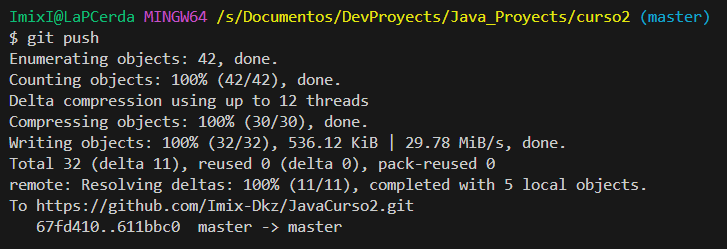

# Manual de CONFIGURACIÓN y USO BASICO de GIT...
Se presenta un pequeño documento y tutorial para el uso de GIT para la carga de proyectos en GitHUB.com

## Requisitos 
* **Tener una cuenta activa de GitHub**, en caso de no tenerla, **crearla** en la página [github.com](https://github.com)
* Tener instalada alguna versión de GIT y GitBash( la terminal por defecto de GIT ), es caso de no tenerla, descargarla de la [página de GIT](https://git-scm.com/downloads), en mi caso tengo la versión 2.41, ahora mismo la versión más nueva creo que es la 2.44, no deberia de haber gran diferencia, instalenlo
* Al terminar esa instalación deben de tener uno o más programas con el siguiente icono...
  + 

## Primeros pasos
* Abrán el que dice "Git Bash" y ubiquence en la carpeta en la que tienen su proyecto de Java
* Se pueden desplazar en ella con comandos de directorio de linux, como:
  + cd [NAME_DIR] 
  + cd ..         //Para Ir al directorio superior
  + Arrastrar la carpeta del proyecto desde el explorador de archivos a la terminal y ubicarse al principio e iniciar el comando con "cd [RUTA]"
  
## Inicialización de GIT en el proyecto
* Si ya estas ubicado en el directorio de del proyecto desde la terminal(revisar imagen), ejecutar el siguiente comando:
    >    git init 
    + 
* Con eso se inicializará el directorio con las cosas necesarias, para llevar un control de GIT del proyecto
* Lo siguiente, será realizar el primer "COMMIT", para eso PRIMERO, hay que preparar los archivos que serán "commiteados"
* Desde la terminal, hay que ver que archivos están pendientes por agregar, ya sea porque es archivo NUEVO ó porque recien se modifico, estó se hace con "git status"
    >    git status
    + 
* Para agregar los archivos modificados, pueden hacerlo con el comando "git add ."
    >    git add .
    + Pueden comprobar que se prepararón correctamente los archivos, nuevamente con "git status", se tendria que ver más o menos así...
    + 
* Hecho esto lo siguiente es "commitearlos", para hacer un "commit", lo correcto es agregar un mensaje que describa lo que se está haciendo o el cambio que se está realizando, en nuestro caso será...
    >     git commit -m "Primer Commit"
    + 
    + Si lo hicieron correctamente al ejecutar "git status", si no han alterado ningún archivo más, deberia de verse algo así...
    + 
* **LISTO**, con eso el proyecto estará siendo supervisado en versiones por GIT 
* Lo siguiente será vincular su terminal local de GitBash, con su cuenta online de GitHub

## Creando un repositorio en GitHub ...
Para esto ubicarse en la pagina principal de [github](github.com) con su cuenta iniciada...

Deberia de verse algo así:

Escribir el nombre del repositorio( se recomienda sin espacios o usar guiones para simularlos), por ejemplo "repo-java", al hacerlo, la primera pantalla que mostrará la pagina de git-hub será algo así...

 
Lo siguiente será seguir los paso para vincular la terminal a la cuenta, nos centraemos en los pasos que sugiere la propia página...

### **Pero antes**... 
## Desde la terminal de GitBash...
* Asegurence de que siguen en el directorio en el que se inicializó el proyecto en GIT, en caso contrario, vuelvan a ubicarse en el...
  + Registrar el correo de su cuenta de github:
    >    git config --global user.email "hello@example.com"
  + Registrar su nombre de usuario de githubs:
    >    git config --global user.name "MiNombreDeUsuario"

* Si lo hicieron correctamente al ejecutar :
    >    git config --list
  + Veran algo similar a esto, con los datos que **USTEDES INGRESARON**
  + 

Lo siguientes es seguir los pasos que nos indico la página de github para cargar nuestro repositorio(**USEN LOS DATOS DE SU PROPIO REPOSITORIO**) ...
  + >    git remote add origin https://github.com/Imix-Dkz/repo-java.git
  + >    git push -u origin main

### [NOTA]
Despues de eso les saldra una ventana de validación de cuenta, pueden hacerlo con los **datos de su cuenta** de github y con eso podrán, continuar, hay otros metodos como los TOKEN temporales o accesos especiales, pero por ahora usaremos ese, si se hizo correctamente al escribir "git push"( despues de hacer un commit correcto ), se podrá ver lo siguiente ...:
* >    git push
* 

## LISTO!!!
Con eso tendrán su proyecto subido a su cuenta de github :
 * 

[NOTA]:
* Hay mucho más que aprender de GIT, recomiendo el siguiente video, para aprender un poco más al respecto sobre sus usos y ventajas(es un poco largo, 4hrs~), pero considero que es muy útil y claro sobre lo que se puede hacer ...
* 
* [Curso de GIT desde CERO (Completo)](https://youtu.be/9ZJ-K-zk_Go?si=AplYhpwiIQ_zyb7G)
* Del Canal: **Soy Dalton**, en Youtube